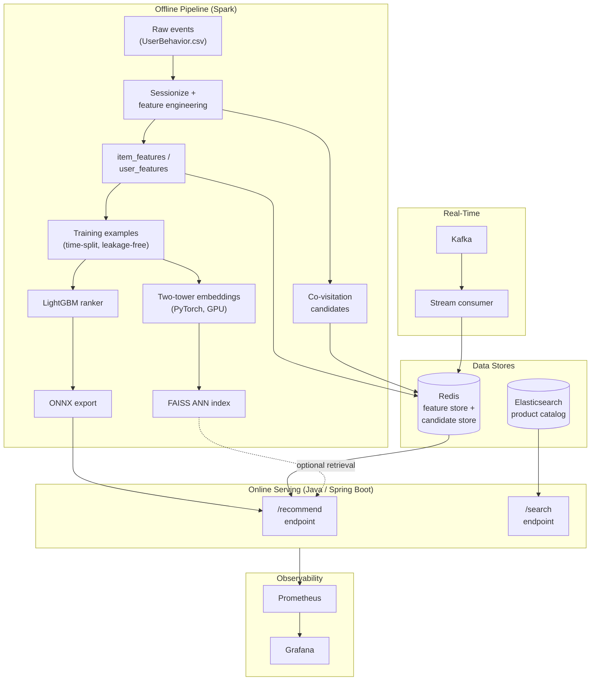

# E-Commerce Recommendation System

An end-to-end recommendation system built on real e-commerce clickstream data — covering the full path from raw event data to a live, load-tested serving API: offline data pipelines, candidate generation, a trained ranking model, real-time streaming feature updates, product search, and observability.

Built as a systems/infrastructure-focused project: the emphasis throughout is on **data pipelines, storage, and serving performance**, not on state-of-the-art modeling.

## Scope note

Everything below was built, run, and validated on a **5% sample of users** from the full dataset (~49,000 of ~1,000,000 users, ~972,000 of ~4.16,000,000 items) — not the full 100M-row dataset. All metrics in this README are real results from that sample, run end-to-end on real infrastructure (not synthetic data), but scaling to the full dataset would require re-running the same pipeline with more compute/time, not new code.

## Architecture



## What's real vs. what's a stand-in

Being upfront about this, since it matters for how the results should be read:

- **All behavioral data, features, training labels, and metrics below are real** — computed from actual user interactions in the dataset, not synthetic or fabricated.
- **Product titles in the search index are synthetic** (e.g. `"Item 812879 (Category 4756105)"`). The dataset has no real product names/descriptions — only numeric IDs. Titles were generated purely to demonstrate genuine Elasticsearch full-text matching and relevance scoring; the structured fields they're attached to (category, popularity, purchase counts) are all real.
- **The ranker's high AUC partly reflects popularity bias** — the model has learned "who's a generally active buyer" and "what's broadly popular" as strong signals, which is real and useful, but is a different thing from deeply personalized taste modeling. Worth knowing, not a flaw.

## Results (real, measured)

| Stage | Metric | Value |
|---|---|---|
| Dataset | Rows sampled | 4,991,875 events, 49,222 users |
| Ranker (LightGBM) | AUC | 0.9542 |
| Ranker (LightGBM) | Recall@10 | 0.9480 |
| Ranker (LightGBM) | NDCG@10 | 0.9299 |
| Embeddings (two-tower, GPU) | Best-checkpoint val AUC | 0.9583 |
| Redis feature store | Keys loaded | 972,562 items, 49,221 users (~6s load) |
| Elasticsearch | Documents indexed | 972,562 |
| Load test — `/recommend` | p50 / p95 / p99 latency | 2ms / 10-12ms / 18-19ms |
| Load test — `/search` | p50 / p95 / p99 latency | 9-10ms / 13-15ms / 19-22ms |
| Load test | Throughput, 50 concurrent users | ~88-92 req/sec, 0 failures across 5,000+ requests |

All numbers above were captured directly from real runs (Spark job output, LightGBM evaluation, Locust load-test summaries) — not estimated.

## Tech stack

| Layer | Technology |
|---|---|
| Batch data processing | Apache Spark (PySpark) |
| Ranking model | LightGBM |
| Embeddings | PyTorch (two-tower model, GPU-trained) |
| Vector retrieval | FAISS |
| Feature / candidate store | Redis |
| Search | Elasticsearch |
| Streaming | Kafka + Python consumer |
| Online serving | Java 17, Spring Boot |
| Model serving bridge | ONNX / ONNX Runtime (Python-trained → Java-served) |
| Load testing | Locust |
| Observability | Micrometer, Prometheus, Grafana |

## Project structure

```
ecommerce-recsys/
├── src/
│   ├── pipeline/          # All Python/Spark pipeline scripts (01-14, numbered by phase)
│   └── serving/
│       └── recsys-service/  # Java Spring Boot online serving API
├── docker/
│   ├── docker-compose.yml   # Redis, Kafka, Elasticsearch, Prometheus, Grafana
│   ├── prometheus.yml
│   └── grafana/provisioning/  # Auto-provisioned dashboard + datasource
├── data/                  # Not committed — see Setup
└── requirements.txt
```

## Pipeline stages

| # | Script | What it does |
|---|---|---|
| 1 | `01_sessionize_and_candidates.py` | Sessionizes raw events, computes item/user features from a time-boxed history window, builds co-visitation candidates |
| 2 | `02_build_training_examples.py` | Builds leakage-free training examples: positives from a held-out future window, popularity-weighted negative sampling |
| 3 | `03_train_ranker.py` | Trains and evaluates a LightGBM ranking model (AUC, Recall@K, NDCG@K) |
| 4 | `04_load_redis.py` | Loads item/user features into Redis |
| 5 | `05_export_onnx.py` | Exports the LightGBM model to ONNX for the Java serving layer |
| 6 | `06_build_user_candidates.py` | Precomputes per-user candidate lists (history + co-visitation) |
| 7 | `07_load_candidates_redis.py` | Loads candidate lists into Redis as sorted sets |
| 8 | `08_train_embeddings.py` | Trains a two-tower embedding model on GPU, with best-checkpoint selection |
| 9 | `09_build_faiss_index.py` | Builds a FAISS index over item embeddings for ANN retrieval |
| 10-11 | `10_kafka_producer.py`, `11_kafka_consumer.py` | Real-time event streaming: replays events via Kafka, updates Redis live |
| 12-13 | `12_index_elasticsearch.py`, `13_search_demo.py` | Indexes the catalog into Elasticsearch, demos structured + full-text search |
| 14 | `14_load_test.py` | Locust load test for the `/recommend` and `/search` endpoints |

## Setup

```bash
python3 -m venv venv
source venv/bin/activate
pip install -r requirements.txt
```

Dataset: [Taobao UserBehavior](https://tianchi.aliyun.com/dataset/649) — place `UserBehavior.csv` in `data/raw/` (not committed to this repo; ~3.4GB).

Bring up infrastructure as needed per phase:
```bash
cd docker
docker compose up -d redis                    # feature/candidate store
docker compose up -d kafka zookeeper           # streaming
docker compose up -d elasticsearch             # search
docker compose up -d prometheus grafana        # observability
```

Run the pipeline stages in order (see table above for what each does):
```bash
python src/pipeline/01_sessionize_and_candidates.py --input data/raw/UserBehavior.csv --output data/processed --sample-frac 0.05
python src/pipeline/02_build_training_examples.py --events data/raw/UserBehavior.csv --features data/processed --output data/processed --sample-frac 0.05
python src/pipeline/03_train_ranker.py --input data/processed/train_examples --model-output data/processed/ranker_model.txt
# ... continue through 04-14 as needed
```

## Running the Java serving API

```bash
cd src/serving/recsys-service
# set ranker.model.path in src/main/resources/application.properties to your exported ONNX model
mvn spring-boot:run
```

```bash
curl "http://localhost:8080/recommend?user=<user_id>&topN=10"
curl "http://localhost:8080/search?q=Item%20123&topN=10"
```

## Observability

With Prometheus + Grafana running (`docker compose up -d prometheus grafana`), a dashboard auto-provisions at `http://localhost:3000` — no manual setup — showing request rate, latency percentiles (p50/p95/p99), error rate, and JVM memory, live.

## What this project demonstrates

- Building and debugging real Spark pipelines at scale (including catching and fixing genuine bugs along the way: a feature-table fan-out bug, a leakage bug from computing features over the full time range, a scalability bug from an unbounded cross-join, and corrupted-timestamp data quality issues)
- Leakage-free ML evaluation via a proper time-based train/future split
- Bridging a Python-trained model into a Java production service via ONNX
- Real-time feature updates via Kafka, validated end-to-end (not just unit-tested)
- Blended ranking (model score + a secondary signal) to handle model score saturation
- Search infrastructure with honest separation of real vs. demonstrative data
- Load testing and Prometheus/Grafana observability with real, measured performance numbers
